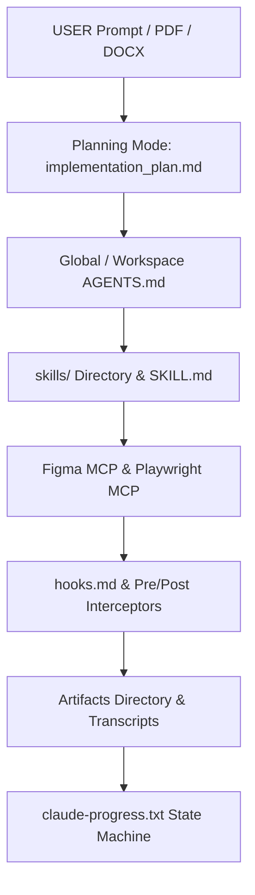

# Harness Engineering Guide: AntiGravity (Google DeepMind)

> **ADE Platform**: AntiGravity IDE (Google DeepMind)  
> **Core Rule Engine**: `.agents/AGENTS.md` & `skills/<skill_name>/SKILL.md`  
> **Harness Concept**: Agentic Pair-Programming, Declarative Skill & Rule Trees, Background Task Management, Artifact Transcripts, Planning Mode.

---

## 1. Architectural Blueprint & Harness Alignment

AntiGravity is an agentic IDE designed for autonomous software development. It operates via context-aware tool calls, background task execution, planning mode artifacts, and structured markdown artifacts.



---

## 2. Directory Layout & Customization Structure

```text
C:\Users\<user>\.gemini\config\          # Global Customizations Root
├── AGENTS.md                            # Global rules (applied to ALL projects)
├── skills/
│   └── global-linting-skill/
│       └── SKILL.md

<workspace>/.agents/                     # Workspace Customizations Root
├── AGENTS.md                            # Project-specific rules
├── skills/
│   ├── figma-html-skill/
│   │   ├── SKILL.md
│   │   ├── scripts/
│   │   │   └── extract_tokens.js
│   │   ├── examples/
│   │   │   └── sample_component.html
│   │   └── references/
│   │       └── figma_api_docs.md
│   ├── playwright-test-skill/
│   │   └── SKILL.md
│   └── docker-cicd-skill/
│       └── SKILL.md
├── skills.json                          # Optional: register non-standard skill paths
└── hooks.md
```

---

## 3. AGENTS.md Deep Dive — Scoping Rules

### Global AGENTS.md (`~/.gemini/config/AGENTS.md`)
```markdown
# Global Engineering Standards

## Code Quality
- Always use TypeScript strict mode (`"strict": true` in tsconfig).
- Every function must have JSDoc comments with @param and @return tags.
- Never commit console.log() statements to production code.

## Naming Conventions
- Components: PascalCase (e.g., `UserProfile.tsx`)
- Utilities: camelCase (e.g., `formatDate.ts`)
- Constants: SCREAMING_SNAKE_CASE (e.g., `MAX_RETRY_COUNT`)
```

### Workspace AGENTS.md (`.agents/AGENTS.md`)
```markdown
# Project-Specific Standards: E-Commerce Dashboard

## Architecture Constraints
- Frontend: React 19 + Vite 6
- Backend: Node.js 22 + Express 5
- Database: PostgreSQL 17 with Drizzle ORM
- All API responses follow JSON:API specification.

## MCP Server Usage
- Figma MCP: Only read frames from file key `aB1c2D3e4F5g`.
- Playwright MCP: Only navigate to localhost:3000 or staging URLs.
```

---

## 4. SKILL.md Advanced Syntax — YAML Frontmatter + Body

```markdown
---
name: Playwright-E2E-Visual-Regression
description: Captures page screenshots via Playwright MCP and compares against Figma baseline images for pixel-level visual regression testing.
---

# Skill: Playwright E2E Visual Regression

## Prerequisites
- Dev server running on `http://localhost:3000`
- Figma baseline screenshots exported to `tests/baselines/`

## Execution Steps
1. Navigate to target page:
   - Tool: `playwright/navigate` → URL: `http://localhost:3000/dashboard`
2. Wait for network idle:
   - Tool: `playwright/waitForLoadState` → State: `networkidle`
3. Capture full-page screenshot:
   - Tool: `playwright/screenshot` → Name: `dashboard_current`
4. Compare against baseline using `pixelmatch`:
   - Tool: `run_command` → `node scripts/compare-screenshots.js dashboard`
5. If diff > 2%, flag visual regression and halt pipeline.

## Guardrails
- Never modify production source code from within this skill.
- Only create/update files under `tests/` and `artifacts/screenshots/`.

## References
- See `references/playwright_mcp_api.md` for full tool argument documentation.
```

---

## 5. Complete Prompt & Command Reference

### Planning Mode Prompts
```
USER: "Build an OAuth2 authentication system with JWT tokens and RBAC"

AntiGravity Response Flow:
  1. Creates implementation_plan.md artifact (request_feedback=true)
  2. STOPS and waits for user approval
  3. On approval → Creates task.md with checklist
  4. Executes tasks sequentially, updating task.md progress
  5. Creates walkthrough.md summarizing changes
```

### Tool Invocation Patterns
```
# File Operations
write_to_file(TargetFile, CodeContent)           → Create new files / artifacts
replace_file_content(TargetFile, Target, Replace) → Edit single contiguous block
multi_replace_file_content(TargetFile, Chunks[])  → Edit multiple non-adjacent blocks

# Shell Execution
run_command(CommandLine, Cwd, WaitMsBeforeAsync)
  → Sync:  run_command("npm test", "./", 10000)
  → Async: run_command("npm run dev", "./", 500)  # Sent to background

# Background Task Management
manage_task(Action="list")                        → See all running tasks
manage_task(Action="status", TaskId="...")         → Check task output
manage_task(Action="kill", TaskId="...")           → Stop a task
manage_task(Action="send_input", TaskId, Input)    → Send stdin to task

# Search & Discovery
grep_search(Query, SearchPath, Includes, IsRegex)  → Ripgrep pattern search
list_dir(DirectoryPath)                            → List directory contents
view_file(AbsolutePath, StartLine, EndLine)        → Read file contents

# User Interaction
ask_question(questions[{question, options, is_multi_select}])
  → Interactive multi-choice modal for Gate approvals

# Browser Automation
browser_subagent(TaskName, Task, RecordingName)
  → Spawns isolated browser agent for visual testing

# MCP Tool Calls (via mcp action permission)
mcp("figma/get_file", {file_key: "aB1c2D3e4F5g"})
mcp("playwright/navigate", {url: "http://localhost:3000"})
mcp("playwright/screenshot", {name: "login_page"})
```

### Practical Prompt Examples for Each Harness Phase

| Phase | Example Prompt to AntiGravity |
| :--- | :--- |
| **Gate 1: BRD** | `"Read the attached requirements.pdf and generate a comprehensive brd.md with functional requirements FR-01 through FR-15 and non-functional requirements NFR-01 through NFR-05."` |
| **Gate 2: Architecture** | `"Based on brd.md, create architecture.md. Use React 19 + Vite frontend, Express 5 backend, PostgreSQL with Drizzle ORM. Include a C4 system context diagram in Mermaid."` |
| **Gate 3: Figma + Proposal** | `"Connect to Figma MCP and inspect file key aB1c2D3e4F5g, frame Node 1:12 (Login Page). Extract design tokens and generate src/presentation/Login.html with tokens.css. Write proposal.md explaining the approach."` |
| **Gate 4: Spec + Agents** | `"Generate spec.md for the Auth API with POST /api/auth/login, POST /api/auth/refresh, and DELETE /api/auth/logout endpoints. Create agents.md mapping a Frontend-Agent and QA-Agent."` |
| **Gate 5: Tasks + Skills** | `"Break down the implementation into task.md with 12 atomic tasks. Generate a SKILL.md for each task under .agents/skills/."` |
| **Gate 6: Test + Deploy** | `"Run Playwright MCP to test the login flow end-to-end. Capture screenshots. If all tests pass, build the Docker image and show me the CI/CD workflow."` |

---

## 6. Advanced Patterns & Insights

### Artifact vs Regular Response Decision Matrix
| Scenario | Use Artifact? | Reason |
| :--- | :--- | :--- |
| Multi-section analysis report | ✅ Yes | Structured, persistent, updatable |
| Simple yes/no answer | ❌ No | Too short for artifact |
| Implementation plan needing approval | ✅ Yes | `RequestFeedback=true` triggers Proceed button |
| Scratch debug script | ✅ Yes (scratch/) | Persisted but not user-facing |

### Background Task Pattern for Dev Server + Testing
```
Step 1: run_command("npm run dev", "./", 500)    → Goes to background
Step 2: schedule(DurationSeconds=5, Prompt="Dev server should be ready")
Step 3: (On timer fire) → browser_subagent("Verify Login Page", ...)
Step 4: run_command("npx playwright test", "./", 10000) → Sync execution
```

### Context Window Handoff Strategy
When AntiGravity detects context window limits approaching:
1. Agent writes current state to `claude-progress.txt`
2. Records exact file paths, line numbers, and next step
3. On next invocation, reads `claude-progress.txt` first
4. Resumes from recorded checkpoint

---

## 7. State & Memory Persistence (`claude-progress.txt`)

```text
================================================================================
ANTIGRAVITY HARNESS EXECUTION PROGRESS LOG
================================================================================
Session: 14bfba91-95ba-44b5-a9da-2a05f8362ba1
Current Phase: Phase 4 - Spec & Agent Definition (Gate 4 Approved)
Active Task: TASK-007 (Playwright MCP E2E Testing)
Last File Edited: src/middleware/auth.ts:42
Last Test Run: npm test → 47/48 passed (1 skipped)
Progress: [X] brd.md [X] architecture.md [X] proposal.md [X] spec.md [>] task.md
Handoff Token: "Resume at Playwright E2E visual test in tests/e2e/auth.spec.ts line 18."
================================================================================
```
