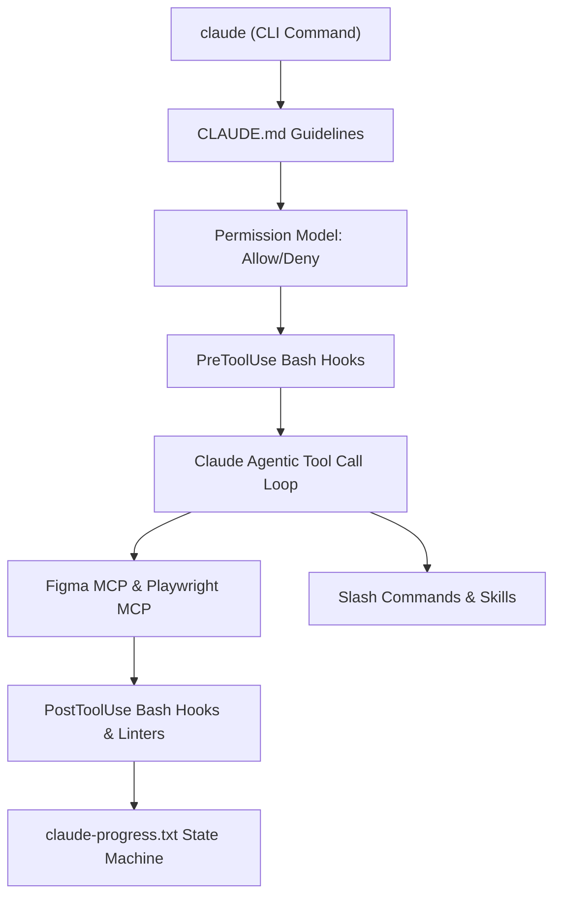
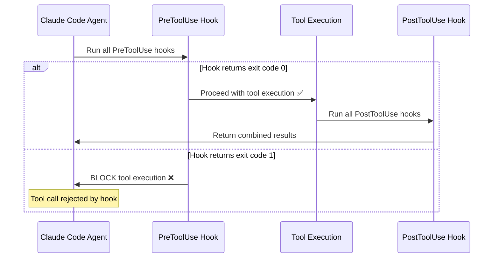

# Harness Engineering Guide: Claude Code (CLI Harness)

> **ADE Platform**: Claude Code (Anthropic CLI Agent)  
> **Core Rule Engine**: `CLAUDE.md` & `.claude/mcp.json` / `hooks/`  
> **Harness Concept**: Terminal Agentic Loops, Modular Slash Commands, PreToolUse / PostToolUse Lifecycle Hooks, Skill File Subroutines, Permission Model.

---

## 1. Architectural Blueprint & Harness Alignment

Claude Code is a **command-line agentic harness** that reads project guidelines from `CLAUDE.md`, executes slash commands, invokes MCP tool servers natively, and enforces security guardrails via bash hooks. It's the most "harness-native" ADE because the entire concept of a Superpower Harness originated from Claude Code's community ecosystem.



---

## 2. Directory Layout & Customization Structure

```text
CLAUDE.md                               # Project root: Primary instruction file
.claude/
├── mcp.json                            # Native MCP Server Configuration
├── settings.json                       # Permission allow/deny lists
├── skills/                             # Modular skill subroutines
│   ├── figma-html/
│   │   ├── SKILL.md
│   │   └── scripts/
│   │       └── extract_tokens.sh
│   ├── playwright-testing/
│   │   └── SKILL.md
│   └── docker-deploy/
│       └── SKILL.md
├── hooks/
│   ├── PreToolUse/                     # Hooks run BEFORE tool execution
│   │   ├── protected-files.sh
│   │   └── syntax-check.sh
│   └── PostToolUse/                    # Hooks run AFTER tool execution
│       ├── auto-lint.sh
│       └── regression-test.sh
└── commands/                           # Custom slash command definitions
    ├── generate-brd.md
    ├── generate-architecture.md
    ├── figma-to-html.md
    ├── generate-spec.md
    └── run-e2e-tests.md

~/.claude/                              # User-level global config
├── CLAUDE.md                           # Global rules (all projects)
├── mcp.json                            # Global MCP servers
└── settings.json                       # Global permissions
```

---

## 3. `CLAUDE.md` — Deep Dive (Multi-Level Scoping)

### Scoping Hierarchy
```
1. ~/.claude/CLAUDE.md          → Global rules (applied everywhere)
2. <project>/CLAUDE.md          → Project root rules
3. <project>/src/CLAUDE.md      → Subdirectory-scoped rules (inherited + local)
```

### Full `CLAUDE.md` Example
```markdown
# CLAUDE.md — E-Commerce Dashboard Project

## Project Context
This is an AI-Powered E-Commerce Dashboard.
- Frontend: React 19 + Vite 6 + TypeScript
- Backend: Node.js 22 + Express 5
- Database: PostgreSQL 17 + Drizzle ORM
- Testing: Playwright (E2E), Vitest (Unit)

## Essential Commands
- Install: `npm ci`
- Dev Server: `npm run dev`
- Build: `npm run build`
- Unit Tests: `npm test`
- E2E Tests: `npx playwright test`
- Lint: `npm run lint`
- Type Check: `npx tsc --noEmit`
- Docker Build: `docker build -t app:latest .`

## Harness Pipeline
Follow this strict document order for all feature work:
1. brd.md → Extract & structure business requirements
2. architecture.md → System topology, tech stack, C4 diagrams
3. proposal.md → Change rationale, alternatives, impact analysis
4. design.md → Figma MCP token extraction & HTML presentation
5. spec.md → API contracts, schemas, edge cases
6. agents.md → Subagent personas & MCP tool bindings
7. task.md → Atomic work unit decomposition
8. SKILL.md → Per-task execution instructions

## Code Standards
- TypeScript strict mode. No `any` types ever.
- React: Functional components only, typed props interfaces.
- API: JSON:API response format. Consistent error codes.
- CSS: Vanilla CSS with custom properties. No frameworks.
- Tests: Every public function needs a unit test.
- Comments: JSDoc on all exported functions.

## File Conventions
- Components: PascalCase (`UserProfile.tsx`)
- Utilities: camelCase (`formatDate.ts`)
- Tests: `*.test.ts` or `*.spec.ts`
- Presentation: `src/presentation/components/*.html`

## Important Warnings
- NEVER modify `.env` or `docker-compose.prod.yml` without asking.
- NEVER commit `console.log()` to production code.
- ALWAYS run `npm test` after modifying files in `src/services/`.
- ALWAYS update claude-progress.txt after completing a phase.
```

---

## 4. Permission Model (`.claude/settings.json`)

```json
{
  "permissions": {
    "allow": [
      "Read(**)",
      "Write(src/**)",
      "Write(tests/**)",
      "Write(docs/**)",
      "Bash(npm test)",
      "Bash(npm run lint)",
      "Bash(npm run build)",
      "Bash(npx playwright test *)",
      "Bash(npx tsc --noEmit)",
      "mcp__figma__get_file",
      "mcp__figma__get_node",
      "mcp__playwright__navigate",
      "mcp__playwright__click",
      "mcp__playwright__fill",
      "mcp__playwright__screenshot"
    ],
    "deny": [
      "Write(.env*)",
      "Write(docker-compose.prod.yml)",
      "Write(package-lock.json)",
      "Bash(rm -rf *)",
      "Bash(npm publish)",
      "Bash(docker push *)"
    ]
  }
}
```

---

## 5. PreToolUse & PostToolUse Hook Scripts — Deep Dive

### Hook Execution Flow


### `PreToolUse/protected-files.sh`
```bash
#!/bin/bash
# Hook: Prevent modification of critical files
# Input: Tool name, file path, and action via environment variables

TOOL_NAME="$CLAUDE_TOOL_NAME"
FILE_PATH="$CLAUDE_FILE_PATH"

PROTECTED_FILES=(".env" ".env.local" "docker-compose.prod.yml" "package-lock.json")

for protected in "${PROTECTED_FILES[@]}"; do
  if [[ "$FILE_PATH" == *"$protected"* ]]; then
    echo "🛑 BLOCKED: Cannot modify protected file: $FILE_PATH"
    echo "   Request explicit user permission first."
    exit 1
  fi
done

exit 0
```

### `PostToolUse/auto-lint.sh`
```bash
#!/bin/bash
# Hook: Auto-lint after file modifications

FILE_PATH="$CLAUDE_FILE_PATH"
TOOL_NAME="$CLAUDE_TOOL_NAME"

# Only run after write operations
if [[ "$TOOL_NAME" == "write_to_file" || "$TOOL_NAME" == "edit_file" ]]; then
  if [[ "$FILE_PATH" == *.ts || "$FILE_PATH" == *.tsx || "$FILE_PATH" == *.js ]]; then
    echo "🔧 Running ESLint on $FILE_PATH..."
    npx eslint --fix "$FILE_PATH" 2>/dev/null
  fi
fi

exit 0
```

### `PostToolUse/regression-test.sh`
```bash
#!/bin/bash
# Hook: Run fast unit tests after modifying service files

FILE_PATH="$CLAUDE_FILE_PATH"

if [[ "$FILE_PATH" == *"src/services/"* ]]; then
  echo "🧪 Running fast regression tests..."
  npm run test:fast 2>&1
  if [[ $? -ne 0 ]]; then
    echo "❌ Regression test FAILED. Review changes."
    exit 1
  fi
fi

exit 0
```

---

## 6. Custom Slash Commands (`.claude/commands/`)

### Slash Command Definition Example
```markdown
<!-- .claude/commands/generate-brd.md -->
# Generate Business Requirements Document

Parse the provided requirements document and generate a comprehensive `brd.md`.

## Instructions
1. Read the input file: $ARGUMENTS
2. Extract all functional requirements (label FR-01 through FR-N).
3. Extract all non-functional requirements (label NFR-01 through NFR-N).
4. Include: Executive Summary, Problem Statement, Stakeholders, Scope.
5. Write output to `docs/brd.md`.
6. Update `claude-progress.txt` with Gate 1 completion.
```

### Using Slash Commands
```bash
# In Claude Code CLI:
claude> /generate-brd docs/requirements.pdf

claude> /figma-to-html --frame "1:12" --component "LoginPage"

claude> /generate-spec --from docs/brd.md docs/architecture.md

claude> /run-e2e-tests tests/e2e/auth.spec.ts

# Built-in Claude Code commands:
claude> /init                    # Initialize CLAUDE.md in project
claude> /cost                    # Show token usage and costs
claude> /clear                   # Clear conversation history
claude> /compact                 # Compact context window
claude> /memory                  # View/edit persistent memories
claude> /permissions             # View current permission grants
```

---

## 7. MCP Server Configuration (`.claude/mcp.json`)

```json
{
  "mcpServers": {
    "figma": {
      "command": "npx",
      "args": ["-y", "@modelcontextprotocol/server-figma"],
      "env": { "FIGMA_PERSONAL_ACCESS_TOKEN": "${FIGMA_TOKEN}" }
    },
    "playwright": {
      "command": "npx",
      "args": ["-y", "@playwright/mcp-server@latest"],
      "env": {
        "PLAYWRIGHT_HEADLESS": "true",
        "PLAYWRIGHT_SCREENSHOT_DIR": "./artifacts/screenshots"
      }
    },
    "filesystem": {
      "command": "npx",
      "args": ["-y", "@modelcontextprotocol/server-filesystem", "./src"]
    },
    "github": {
      "command": "npx",
      "args": ["-y", "@modelcontextprotocol/server-github"],
      "env": { "GITHUB_TOKEN": "${GITHUB_TOKEN}" }
    }
  }
}
```

---

## 8. Complete Prompt & Command Reference

### CLI Invocation Modes
```bash
# Interactive mode (default)
claude

# Single prompt (one-shot)
claude "Generate brd.md from docs/requirements.pdf"

# Pipe input
cat requirements.pdf | claude "Parse this and generate brd.md"

# Resume previous session
claude --resume

# Use specific model
claude --model claude-sonnet-4

# With specific permission grants
claude --allowedTools "Write(src/**)" --allowedTools "Bash(npm test)"
```

### Practical Prompts for Each Harness Phase

| Phase | Claude Code Prompt |
| :--- | :--- |
| **Gate 1: BRD** | `"Read docs/requirements.pdf and generate docs/brd.md with FR-01 to FR-12, NFR-01 to NFR-05, stakeholder analysis, and compliance section. Show me for review before proceeding."` |
| **Gate 2: Architecture** | `"Based on docs/brd.md, create docs/architecture.md. React 19 + Vite, Express 5, PostgreSQL + Drizzle ORM. Include Mermaid C4 system context diagram. Wait for my approval."` |
| **Gate 3: Figma + Proposal** | `"Use the figma MCP to inspect file aB1c2D3e4F5g node 1:12. Extract design tokens (colors, typography, spacing). Generate src/presentation/components/Login.html and styles/tokens.css. Write docs/proposal.md. Pause for review."` |
| **Gate 4: Spec + Agents** | `"Generate docs/spec.md with OpenAPI 3.1 for auth endpoints. Create docs/agents.md mapping Auth-Backend-Agent, Frontend-Presentation-Agent, and Playwright-QA-Agent with their MCP tool permissions."` |
| **Gate 5: Tasks + Skills** | `"Decompose spec.md into 12 atomic tasks in docs/task.md. Create .claude/skills/ with SKILL.md for each task containing step-by-step instructions and verification commands."` |
| **Gate 6: Test + Deploy** | `"Use playwright MCP: navigate to localhost:3000/login, fill #email with test@test.com, fill #password with Test123!, click #login-btn, screenshot login_success. Then create Dockerfile and .github/workflows/ci-cd.yml."` |
