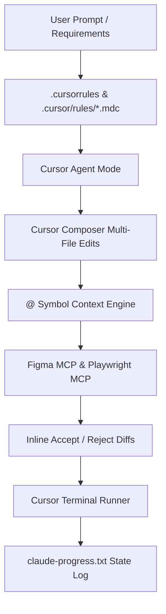
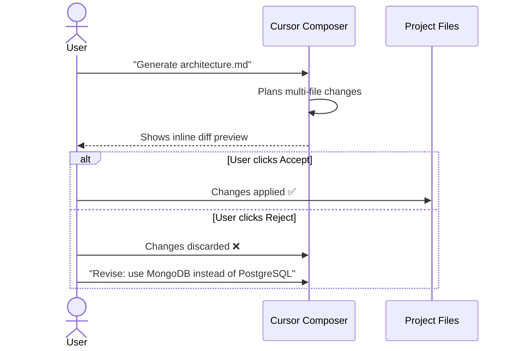

# Harness Engineering Guide: Cursor ADE

> **ADE Platform**: Cursor IDE (Anysphere)  
> **Core Rule Engine**: `.cursorrules` & `.cursor/rules/*.mdc`  
> **Harness Concept**: Composer Multi-File Editing, `@` Symbol Context Referencing, Merkle-Tree Vector Indexing, Rule Glob Matching, Agent Mode.

---

## 1. Architectural Blueprint & Harness Alignment

Cursor relies on high-speed vector codebase indexing, `@` symbol context references (`@Codebase`, `@Git`, `@Files`, `@Web`, `@Docs`), multi-file editing via Cursor Composer, and an Agent Mode for autonomous execution.



---

## 2. Directory Layout & Customization Structure

```text
.cursorrules                            # Root-level fallback rules (legacy, still supported)
.cursor/
├── rules/
│   ├── 01-harness-pipeline.mdc         # General harness document pipeline rules
│   ├── 02-figma-html-conversion.mdc    # Glob: src/presentation/**/*
│   ├── 03-playwright-testing.mdc       # Glob: tests/e2e/**/*
│   ├── 04-openspec-proposals.mdc       # Glob: .openspec/**/*
│   ├── 05-api-contracts.mdc            # Glob: src/api/**/*
│   └── 06-docker-cicd.mdc             # Glob: Dockerfile, docker-compose.yml, .github/**/*
├── mcp.json                            # Cursor MCP Server Configuration
└── prompts/                            # Reusable prompt snippets (optional)
```

---

## 3. `.cursorrules` vs `.cursor/rules/*.mdc` — Deep Dive

### `.cursorrules` (Global Fallback)
Applied to **every** file and prompt in the project. Best for universal standards:

```markdown
# Cursor Global Rules

## Universal Standards
- Use TypeScript strict mode everywhere.
- Every React component must be a functional component with typed props interface.
- Never use `any` type. Use `unknown` and narrow with type guards.
- Follow the Harness Pipeline: brd.md → architecture.md → proposal.md → spec.md → task.md.
- Always ask for user confirmation before modifying files outside `src/`.

## State Persistence
- After completing any major phase, update `claude-progress.txt` at project root.
```

### `.cursor/rules/*.mdc` (Glob-Scoped Rules)
Applied **only** when the user is working on files matching the glob pattern:

```markdown
<!-- File: .cursor/rules/02-figma-html-conversion.mdc -->
---
description: Rules for converting Figma designs into HTML/CSS presentation components.
globs: src/presentation/**/*
alwaysApply: false
---

# Cursor Rule: Figma HTML Presentation Layer

## Auto-Injected Context
When editing any file under `src/presentation/`:
1. Query `@figma` MCP for the matching frame design tokens.
2. Use CSS custom properties from `src/presentation/styles/tokens.css`.
3. All interactive elements MUST have unique `id` attributes for Playwright testing.
4. Generate semantic HTML5 (`<nav>`, `<main>`, `<section>`, `<article>`).

## Prohibited Actions
- Do NOT use inline styles.
- Do NOT import external CSS frameworks (no Tailwind, Bootstrap).
```

### Rule Loading Priority (Important for Interviews!)
```
1. .cursor/rules/*.mdc (glob-matched, highest specificity)
2. .cursorrules (project-wide fallback)
3. User Settings → Custom Instructions (IDE-level global)
```

---

## 4. `@` Symbol Context System — Complete Reference

| Symbol | What It References | Example Usage |
| :--- | :--- | :--- |
| `@Codebase` | Entire indexed codebase (Merkle-tree vector search) | `"@Codebase where is JWT validation implemented?"` |
| `@Files` | Specific file(s) by name | `"@Files src/auth/jwt.ts explain this middleware"` |
| `@Folders` | Entire directory subtrees | `"@Folders src/presentation/ list all components"` |
| `@Git` | Git history, diffs, and commit messages | `"@Git what changed in the last 3 commits?"` |
| `@Web` | Live web search results | `"@Web latest Playwright MCP server documentation"` |
| `@Docs` | Indexed documentation sites | `"@Docs React 19 useActionState hook usage"` |
| `@Definitions` | Symbol definitions (functions, classes) | `"@Definitions AuthMiddleware show implementation"` |
| `@Chat` | Previous conversation messages | `"@Chat what was the architecture decision we made?"` |

---

## 5. MCP Server Configuration (`.cursor/mcp.json`)

```json
{
  "mcpServers": {
    "figma": {
      "command": "npx",
      "args": ["-y", "@modelcontextprotocol/server-figma"],
      "env": { "FIGMA_PERSONAL_ACCESS_TOKEN": "${FIGMA_TOKEN}" }
    },
    "playwright": {
      "command": "npx",
      "args": ["-y", "@playwright/mcp-server@latest"],
      "env": { "PLAYWRIGHT_HEADLESS": "true" }
    },
    "filesystem": {
      "command": "npx",
      "args": ["-y", "@modelcontextprotocol/server-filesystem", "./src"]
    }
  }
}
```

---

## 6. Complete Prompt & Command Reference

### Cursor Keyboard Shortcuts
| Shortcut | Function | Harness Usage |
| :--- | :--- | :--- |
| `Ctrl+K` / `Cmd+K` | Inline Edit (single file) | Quick single-file code generation |
| `Ctrl+I` / `Cmd+I` | Open Composer (multi-file) | Generating multiple harness documents simultaneously |
| `Ctrl+L` / `Cmd+L` | Open Chat Panel | Q&A, architecture discussions, gate reviews |
| `Ctrl+Shift+I` | Toggle Agent Mode | Autonomous multi-step harness execution |
| `Tab` | Accept autocomplete / suggestion | Accept inline AI suggestions |
| `Esc` | Reject suggestion | Reject unwanted changes |

### Practical Prompt Examples for Each Harness Phase

| Phase | Cursor Prompt | Mode |
| :--- | :--- | :--- |
| **Gate 1: BRD** | `"@Files requirements.pdf Parse this document and generate brd.md with FR-01 to FR-12 functional requirements and NFR-01 to NFR-05 non-functional requirements. Include stakeholder analysis."` | Composer |
| **Gate 2: Architecture** | `"@Codebase Based on brd.md, create architecture.md. Use Next.js 15 App Router, Prisma ORM with PostgreSQL, Redis cache. Draw C4 system context diagram in Mermaid. Show me for review before proceeding."` | Composer |
| **Gate 3: Figma + Proposal** | `"Use @figma MCP to inspect file aB1c2D3e4F5g frame Node 1:12. Extract colors, typography, spacing tokens. Generate src/presentation/Login.html and tokens.css. Create proposal.md explaining the conversion approach."` | Agent Mode |
| **Gate 4: Spec + Agents** | `"@Files brd.md @Files architecture.md Generate spec.md with OpenAPI 3.1 definitions for auth, users, and dashboard endpoints. Create agents.md mapping Frontend-Agent and QA-Agent with their tool permissions."` | Composer |
| **Gate 5: Tasks + Skills** | `"Break the spec.md into 15 atomic tasks in task.md. For each task, create a corresponding SKILL.md under .cursor/rules/ with glob-matched execution instructions."` | Agent Mode |
| **Gate 6: Test + Deploy** | `"Use @playwright MCP to navigate to http://localhost:3000/login, fill email and password, click submit, and screenshot the dashboard redirect. Then generate Dockerfile and GitHub Actions CI/CD workflow."` | Agent Mode |

### Agent Mode vs Composer vs Chat — When to Use What

| Scenario | Recommended Mode | Why |
| :--- | :--- | :--- |
| Generate brd.md from PDF | **Composer** | Multi-file output, structured generation |
| Quick code explanation | **Chat** (`Ctrl+L`) | Read-only, no file changes needed |
| Full harness pipeline run | **Agent Mode** | Autonomous multi-step execution with tool calls |
| Single function refactor | **Inline Edit** (`Ctrl+K`) | Targeted, single-block change |
| Figma → HTML conversion | **Agent Mode** | Requires MCP tool calls + file writes |
| Review git diff | **Chat** with `@Git` | Read-only analysis |

---

## 7. Composer Accept/Reject as User Gate Mechanism

In Cursor, Composer shows inline diffs for **every** file it modifies. The user must explicitly click:
- **✅ Accept** → Applies the change (equivalent to Gate Approval).
- **❌ Reject** → Discards the change (equivalent to Gate Rejection).
- **Accept All** → Batch approve all pending diffs.

This diff-based approval system IS the native Gate mechanism in Cursor — no separate confirmation modal exists.



---

## 8. State & Memory Persistence

Cursor does **not** have built-in progress tracking. You must explicitly maintain `claude-progress.txt`:

```text
================================================================================
CURSOR HARNESS EXECUTION PROGRESS LOG
================================================================================
Project: E-Commerce Dashboard
IDE: Cursor v0.45
Current Phase: Phase 3 - Presentation Layer (Gate 3 Pending)
Last Composer Session: Generated architecture.md (Accepted)
Active Rule Files: 02-figma-html-conversion.mdc (src/presentation/*)
MCP Servers Active: figma, playwright
Progress: [X] brd.md [X] architecture.md [>] proposal.md [ ] spec.md [ ] task.md
Handoff: "Resume at Figma MCP frame extraction for Login component."
================================================================================
```
