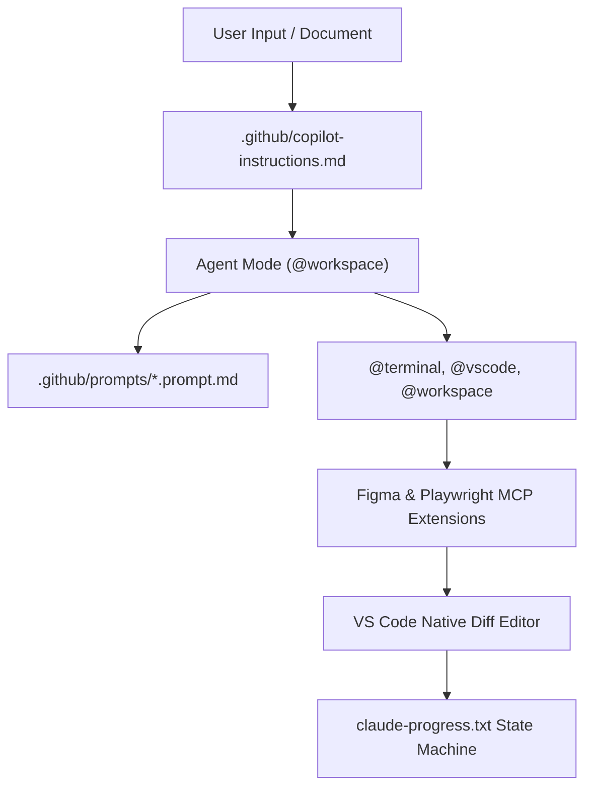
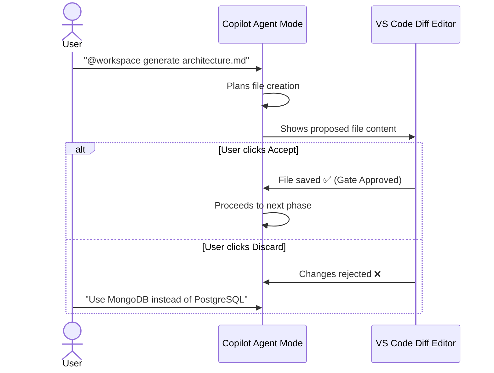

# Harness Engineering Guide: VS Code + GitHub Copilot

> **ADE Platform**: VS Code with GitHub Copilot (Agent Mode)  
> **Core Rule Engine**: `.github/copilot-instructions.md` & `.github/prompts/*.prompt.md`  
> **Harness Concept**: Workspace Agent Mode (`@workspace`), Custom Prompt Templates, Participant Extensions, VS Code Task Runners.

---

## 1. Architectural Blueprint & Harness Alignment

GitHub Copilot in VS Code operates through three modes: **Chat**, **Inline Suggestions**, and **Agent Mode** (`@workspace`). Agent Mode enables autonomous multi-step execution with tool use.



---

## 2. Directory Layout & Customization Structure

```text
.github/
├── copilot-instructions.md             # Global instructions for Copilot Chat & Agent Mode
├── prompts/
│   ├── 01-generate-brd.prompt.md       # Prompt template for BRD extraction
│   ├── 02-generate-architecture.prompt.md
│   ├── 03-figma-to-html.prompt.md      # Prompt template with Figma MCP
│   ├── 04-openspec-proposal.prompt.md
│   ├── 05-generate-spec.prompt.md
│   ├── 06-playwright-test.prompt.md
│   └── 07-docker-cicd.prompt.md
├── workflows/
│   └── ci-cd-pipeline.yml              # GitHub Actions CI/CD
└── mcp.json                            # VS Code MCP Server Configuration (if supported)
.vscode/
├── settings.json                       # Copilot model selection & extension settings
└── tasks.json                          # VS Code Task runners for build/test/lint
```

---

## 3. `copilot-instructions.md` — Deep Dive

This file is automatically read by Copilot Chat and Agent Mode for every interaction in the project:

```markdown
# GitHub Copilot Workspace Instructions

## Project Context
This is an AI-Powered E-Commerce Dashboard built with:
- Frontend: React 19 + Vite 6 + TypeScript
- Backend: Node.js 22 + Express 5
- Database: PostgreSQL 17 + Drizzle ORM
- Testing: Playwright for E2E, Vitest for unit tests

## Harness Engineering Pipeline
Follow this strict document generation order:
1. `brd.md` → Business requirements extraction
2. `architecture.md` → System topology & tech stack
3. `proposal.md` → Change rationale (OpenSpec format)
4. `design.md` → UI/UX via Figma MCP token extraction
5. `spec.md` → API contracts with OpenAPI 3.1 schemas
6. `agents.md` → Subagent persona definitions
7. `task.md` → Atomic work unit decomposition
8. `SKILL.md` → Per-task execution instructions

## User Confirmation Gates
- ALWAYS present generated documents for review before proceeding.
- Use the chat response to explain key decisions and ask for approval.
- Never modify production code without an approved spec.md.

## Code Standards
- TypeScript strict mode with no `any` types.
- React functional components with typed props.
- All API handlers return typed response objects.
- Every endpoint must have integration tests.
```

---

## 4. Custom Prompt Templates (`.github/prompts/*.prompt.md`)

### Template Syntax
```markdown
<!-- File: .github/prompts/03-figma-to-html.prompt.md -->
---
description: Convert Figma Frame into semantic HTML/CSS presentation code
mode: agent
tools: ['figma', 'terminal', 'editFiles']
variables:
  - name: figma_frame_id
    description: The Figma node ID to inspect
  - name: component_name
    description: Name of the HTML component to generate
---

# Figma to HTML Conversion

## Instructions
1. Use Figma MCP to inspect frame `${figma_frame_id}` from the project Figma file.
2. Extract all design tokens: colors, typography, spacing, border-radius.
3. Write CSS custom properties to `src/presentation/styles/tokens.css`.
4. Generate semantic HTML5 component at `src/presentation/components/${component_name}.html`.
5. Ensure all interactive elements have unique `id` attributes.
6. Show me the generated files for review before applying.
```

### Using Prompt Templates
```
# In Copilot Chat:
@workspace /03-figma-to-html figma_frame_id="1:12" component_name="LoginPage"

# Or via Command Palette:
Ctrl+Shift+P → "GitHub Copilot: Run Prompt" → Select template
```

---

## 5. `@` Participants & Context System

| Participant | What It Does | Example Usage |
| :--- | :--- | :--- |
| `@workspace` | Full codebase agent with tool use | `"@workspace generate brd.md from requirements.pdf"` |
| `@terminal` | Executes terminal commands | `"@terminal run npm test and show results"` |
| `@vscode` | VS Code editor actions | `"@vscode open the diff view for architecture.md"` |
| `#file` | References specific files | `"Explain #file:src/auth/jwt.ts"` |
| `#selection` | References highlighted code | `"Refactor #selection to use async/await"` |
| `#terminalLastCommand` | Last terminal output | `"#terminalLastCommand explain this error"` |
| `#codebase` | Semantic codebase search | `"#codebase where is user authentication handled?"` |

---

## 6. Complete Prompt & Command Reference

### Keyboard Shortcuts
| Shortcut | Function | Harness Usage |
| :--- | :--- | :--- |
| `Ctrl+I` / `Cmd+I` | Open Copilot Inline Chat | Quick single-file edits |
| `Ctrl+Shift+I` | Open Copilot Chat Panel | Multi-turn harness discussions |
| `Ctrl+Enter` | Send message in Chat | Submit prompts |
| `Tab` | Accept suggestion | Accept inline code completion |
| `Esc` | Dismiss suggestion | Reject unwanted suggestions |
| `Ctrl+Shift+P` | Command Palette | Access "Run Prompt" and Copilot commands |

### Practical Prompt Examples for Each Harness Phase

| Phase | Copilot Prompt | Mode |
| :--- | :--- | :--- |
| **Gate 1: BRD** | `"@workspace Read #file:docs/requirements.pdf and generate docs/brd.md with functional requirements FR-01 to FR-12. Include stakeholder analysis and compliance section. Show me for review."` | Agent Mode |
| **Gate 2: Architecture** | `"@workspace Based on #file:docs/brd.md, create docs/architecture.md. React 19 + Vite frontend, Express 5 backend, PostgreSQL. Include Mermaid C4 diagram. Present for my approval."` | Agent Mode |
| **Gate 3: Figma + Proposal** | `"@workspace /03-figma-to-html figma_frame_id='1:12' component_name='LoginPage'. Also create docs/proposal.md explaining trade-offs."` | Agent Mode + Prompt Template |
| **Gate 4: Spec + Agents** | `"@workspace Generate docs/spec.md with OpenAPI 3.1 for POST /api/auth/login, POST /api/auth/refresh. Create docs/agents.md mapping UI-Agent and QA-Agent."` | Agent Mode |
| **Gate 5: Tasks + Skills** | `"@workspace Break spec.md into 12 tasks in docs/task.md. Create .github/prompts/ templates for each task with specific execution steps."` | Agent Mode |
| **Gate 6: Test + Deploy** | `"@terminal npx playwright test tests/e2e/login.spec.ts" then "@workspace create Dockerfile and .github/workflows/ci-cd.yml"` | Terminal + Agent |

### Agent Mode Tool Capabilities
```
Agent Mode (@workspace) can autonomously:
  ✅ Read and write files
  ✅ Execute terminal commands
  ✅ Search codebase semantically
  ✅ Call MCP server tools
  ✅ Generate multi-file changes with diff preview
  ✅ Run linters and formatters
  
Agent Mode CANNOT:
  ❌ Apply changes without user clicking "Accept"
  ❌ Access files outside workspace
  ❌ Make network requests beyond MCP servers
```

---

## 7. User Gate Mechanism in Copilot

Copilot presents changes in the **VS Code Diff Editor** for review:



---

## 8. VS Code Tasks Integration (`tasks.json`)

```json
{
  "version": "2.0.0",
  "tasks": [
    {
      "label": "Harness: Run Unit Tests",
      "type": "shell",
      "command": "npm test",
      "group": "test",
      "problemMatcher": ["$tsc"]
    },
    {
      "label": "Harness: Run Playwright E2E",
      "type": "shell",
      "command": "npx playwright test",
      "group": "test"
    },
    {
      "label": "Harness: Docker Build",
      "type": "shell",
      "command": "docker build -t app:latest .",
      "group": "build"
    }
  ]
}
```
