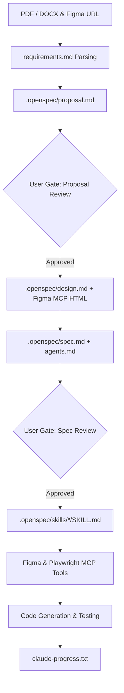

# Harness Engineering Guide: OpenSpec & Kiro ADE

> **ADE Platform**: OpenSpec Specification Engine / Kiro AI (AWS)  
> **Core Rule Engine**: `.openspec/` Schema Directory & `proposal.md` / `spec.md`  
> **Harness Concept**: Specification-Driven AI Engineering, Declarative Delta Specs, Agent Spec Mapping (`agents.md`), Skill Routines (`SKILL.md`), Steering Files.

---

## 1. Architectural Blueprint & Harness Alignment

OpenSpec and Kiro enforce **Specification-Driven Development** (SDD). The fundamental principle: **No code can be generated or modified without an active, approved specification**. This is the most harness-aligned ADE in the market.



---

## 2. Directory Layout — OpenSpec Standard

This is the **canonical directory structure** that other ADEs attempt to replicate:

```text
.openspec/
├── proposal.md                         # WHY: Change rationale, business case, trade-offs
├── requirements.md                     # WHAT: Structured functional & non-functional requirements
├── design.md                           # HOW (Visual): UI/UX design, Figma tokens, HTML wireframes
├── architecture.md                     # HOW (System): Tech stack, topology, C4 diagrams
├── spec.md                             # HOW (Contract): API specs, schemas, edge cases, error codes
├── agents.md                           # WHO: Agent persona definitions, tool permissions, guardrails
├── dependency_graph.md                 # ORDER: Topological module dependency map
├── features.json                       # REGISTRY: Machine-readable feature status tracker
├── task.md                             # EXECUTION: Atomic work unit decomposition
├── skills/                             # SKILLS: Per-task execution instruction sets
│   ├── auth-middleware/
│   │   ├── SKILL.md
│   │   ├── scripts/
│   │   │   └── generate_jwt.sh
│   │   └── examples/
│   │       └── sample_middleware.ts
│   ├── figma-html/
│   │   └── SKILL.md
│   ├── playwright-qa/
│   │   └── SKILL.md
│   └── docker-deploy/
│       └── SKILL.md
├── hooks.md                            # GUARDRAILS: Pre/post execution validation hooks
└── mcp.json                            # TOOLS: MCP Server manifest
```

---

## 3. OpenSpec Document Schemas — Deep Dive

### `proposal.md` — The WHY Document
```markdown
# OpenSpec Proposal: User Authentication System

## Proposal ID: PROP-2026-007
## Status: PENDING_REVIEW
## Author: AI Agent (Harness Pipeline)
## Reviewer: Human Architect

---

## Executive Summary
Implement OAuth2 authentication with JWT access tokens, refresh token rotation, 
and role-based access control (RBAC) for the E-Commerce Dashboard.

## Business Rationale
- **Problem**: Current session-based auth doesn't scale across microservices.
- **Solution**: Stateless JWT tokens enable horizontal scaling without session stores.
- **ROI**: Eliminates Redis session store ($200/month), reduces auth latency by 40%.

## Alternatives Considered
| Approach | Pros | Cons | Decision |
| :--- | :--- | :--- | :--- |
| JWT + Refresh Tokens | Stateless, scalable | Token revocation complexity | ✅ Selected |
| Session Cookies | Simple, built-in revocation | Requires sticky sessions | ❌ Rejected |
| OAuth2 + OIDC (External IdP) | Enterprise-grade | Vendor lock-in, cost | ❌ Deferred to v2 |

## Impact Analysis
- **New Files**: `src/middleware/auth.ts`, `src/services/tokenService.ts`
- **Modified Files**: `src/routes/index.ts`, `src/config/env.ts`
- **MCP Dependencies**: Figma MCP (Login UI frame), Playwright MCP (auth E2E tests)
- **Breaking Changes**: None (additive change)

## Approval Required
> [!IMPORTANT]
> This proposal requires human architect review before spec generation proceeds.
```

### `spec.md` — The CONTRACT Document
```markdown
# OpenSpec Specification: Auth API Contract

## Spec ID: SPEC-AUTH-001
## Linked Proposal: PROP-2026-007
## Status: APPROVED

---

## Endpoints

### POST /api/auth/login
- **Request Body**: `{ "email": string, "password": string }`
- **Success Response** (200): `{ "access_token": string, "refresh_token": string, "expires_in": 3600 }`
- **Error Responses**:
  - 400: `{ "error": "INVALID_CREDENTIALS", "message": "Email or password incorrect" }`
  - 429: `{ "error": "RATE_LIMITED", "message": "Too many attempts", "retry_after": 60 }`

### POST /api/auth/refresh
- **Request Body**: `{ "refresh_token": string }`
- **Success Response** (200): `{ "access_token": string, "expires_in": 3600 }`
- **Error Responses**:
  - 401: `{ "error": "TOKEN_EXPIRED", "message": "Refresh token has expired" }`

### DELETE /api/auth/logout
- **Headers**: `Authorization: Bearer <access_token>`
- **Success Response** (204): No Content
- **Error Response** (401): `{ "error": "UNAUTHORIZED" }`

## Data Schemas
```json
{
  "User": {
    "id": "uuid",
    "email": "string (unique, indexed)",
    "password_hash": "string (bcrypt, 12 rounds)",
    "role": "enum: ['admin', 'user', 'viewer']",
    "created_at": "ISO 8601 timestamp"
  }
}
```

## Edge Cases & Business Rules
- EC-01: Failed login attempts lock account after 5 tries for 15 minutes.
- EC-02: Refresh tokens are single-use; rotation generates new refresh token.
- EC-03: Access tokens contain `user_id`, `role`, `exp` claims.
```

### `agents.md` — The WHO Document (with MCP Bindings)
```markdown
# OpenSpec Agent Declarations

## Agent: Auth-Backend-Agent
- **Assigned Spec**: `spec.md` (Sections: Endpoints, Data Schemas)
- **Bound Skills**: `skills/auth-middleware/SKILL.md`
- **System Prompt**: "You are a backend security engineer. Implement JWT authentication exactly as specified in spec.md. Never deviate from the API contract."
- **Authorized MCP Tools**: 
  - `filesystem/read_file`
  - `filesystem/write_file`
- **File Scope**: `src/middleware/*`, `src/services/*`, `src/routes/auth/*`
- **Prohibited**: Cannot modify `src/presentation/*`, `tests/*`, or config files.

## Agent: Frontend-Presentation-Agent
- **Assigned Spec**: `design.md` (Figma Login Frame)
- **Bound Skills**: `skills/figma-html/SKILL.md`
- **System Prompt**: "You are a frontend presentation engineer. Convert Figma designs into pixel-perfect semantic HTML/CSS."
- **Authorized MCP Tools**: 
  - `figma/get_file`
  - `figma/get_node`
  - `filesystem/write_file`
- **File Scope**: `src/presentation/*` only.

## Agent: Playwright-QA-Agent
- **Assigned Spec**: `spec.md` (Sections: Endpoints, Edge Cases)
- **Bound Skills**: `skills/playwright-qa/SKILL.md`
- **System Prompt**: "You are a QA automation engineer. Write E2E tests that verify every endpoint and edge case in spec.md."
- **Authorized MCP Tools**:
  - `playwright/navigate`
  - `playwright/click`
  - `playwright/fill`
  - `playwright/screenshot`
  - `playwright/expect`
- **File Scope**: `tests/e2e/*` only. Cannot modify application source code.
```

---

## 4. SKILL.md with MCP Tool Binding Examples

```markdown
---
name: Figma-HTML-Conversion-Skill
description: Extracts design tokens from Figma MCP and generates semantic HTML/CSS components.
---

# Skill: Figma to HTML Conversion

## MCP Tool Call Sequence

### Step 1: Fetch Figma File Structure
```
Tool: figma/get_file
Args: { "file_key": "aB1c2D3e4F5g" }
Expected: JSON with document structure, canvas list, and frame IDs.
```

### Step 2: Inspect Target Frame
```
Tool: figma/get_node
Args: { "file_key": "aB1c2D3e4F5g", "node_id": "1:12" }
Expected: JSON with fills (colors), typography (fontFamily, fontSize), 
         absoluteBoundingBox (x, y, width, height), children nodes.
```

### Step 3: Extract Design Tokens
Parse MCP response and write CSS custom properties:
```css
/* src/presentation/styles/tokens.css */
:root {
  --color-primary: #4F46E5;
  --color-bg-dark: #0F172A;
  --font-family-base: 'Inter', sans-serif;
  --font-size-heading: 2rem;
  --spacing-md: 1.5rem;
  --border-radius-lg: 12px;
}
```

### Step 4: Generate Semantic HTML
Write component HTML using extracted tokens:
```html
<!-- src/presentation/components/Login.html -->
<section class="login-container" id="login-section">
  <h1 class="login-title">Welcome Back</h1>
  <form id="login-form" class="login-form">
    <input type="email" id="email" placeholder="Email" required />
    <input type="password" id="password" placeholder="Password" required />
    <button type="submit" id="login-btn" class="btn-primary">Sign In</button>
  </form>
</section>
```

### Step 5: Verify with Playwright MCP
```
Tool: playwright/navigate → URL: "http://localhost:3000/login"
Tool: playwright/screenshot → Name: "login_rendered"
Compare against Figma baseline.
```
```

---

## 5. Kiro-Specific CLI Commands

```bash
# Initialize OpenSpec in project
kiro init --spec-dir .openspec

# Create new proposal
kiro proposal create "User Authentication System"
# Output: Created .openspec/proposal.md (PROP-2026-007)

# Submit proposal for review (Gate 3)
kiro proposal review PROP-2026-007
# Output: Proposal sent for human review. Status: PENDING_REVIEW

# Approve proposal (User action)
kiro proposal approve PROP-2026-007
# Output: Proposal APPROVED. Spec generation unlocked.

# Generate spec from approved proposal
kiro spec generate --from PROP-2026-007
# Output: Created .openspec/spec.md (SPEC-AUTH-001)

# Connect Figma MCP and import design
kiro figma import --file-key aB1c2D3e4F5g --frame "1:12" --output .openspec/design.md

# Assign agents to spec
kiro agent assign --spec SPEC-AUTH-001 --agent-file .openspec/agents.md

# Decompose spec into tasks
kiro task decompose --spec SPEC-AUTH-001 --output .openspec/task.md

# Execute specific agent with skill binding
kiro agent run Auth-Backend-Agent --skill skills/auth-middleware/SKILL.md

# Run Playwright MCP QA agent
kiro agent run Playwright-QA-Agent --skill skills/playwright-qa/SKILL.md

# Check execution progress
kiro progress status
# Output: Phase 4/6 | Tasks: 8/12 complete | Tests: 47/48 passing

# Snapshot progress state
kiro progress snapshot
# Output: Saved to claude-progress.txt

# Gate approval commands
kiro gate list                    # Show all gates and their statuses
kiro gate approve --gate 4        # Approve Gate 4 (Spec & Agent approval)
kiro gate reject --gate 4 --reason "Add rate limiting to login endpoint"
```

---

## 6. Steering Files — Kiro's Unique Concept

Kiro uses **Steering Files** to maintain project direction across sessions:

```markdown
<!-- .openspec/steering.md -->
# Project Steering Document

## Vision
Build a production-grade E-Commerce Dashboard with AI-native engineering practices.

## Non-Negotiable Constraints
- All data in PostgreSQL (no NoSQL).
- Authentication via JWT (no sessions).
- Vanilla CSS only (no frameworks).
- 100% spec coverage before code generation.

## Active Proposals
- PROP-2026-007: Auth System (APPROVED)
- PROP-2026-008: Product Catalog (PENDING_REVIEW)

## Active Specs
- SPEC-AUTH-001: Auth API (IN_PROGRESS)
- SPEC-CATALOG-001: Product CRUD (BLOCKED by PROP-2026-008)
```
