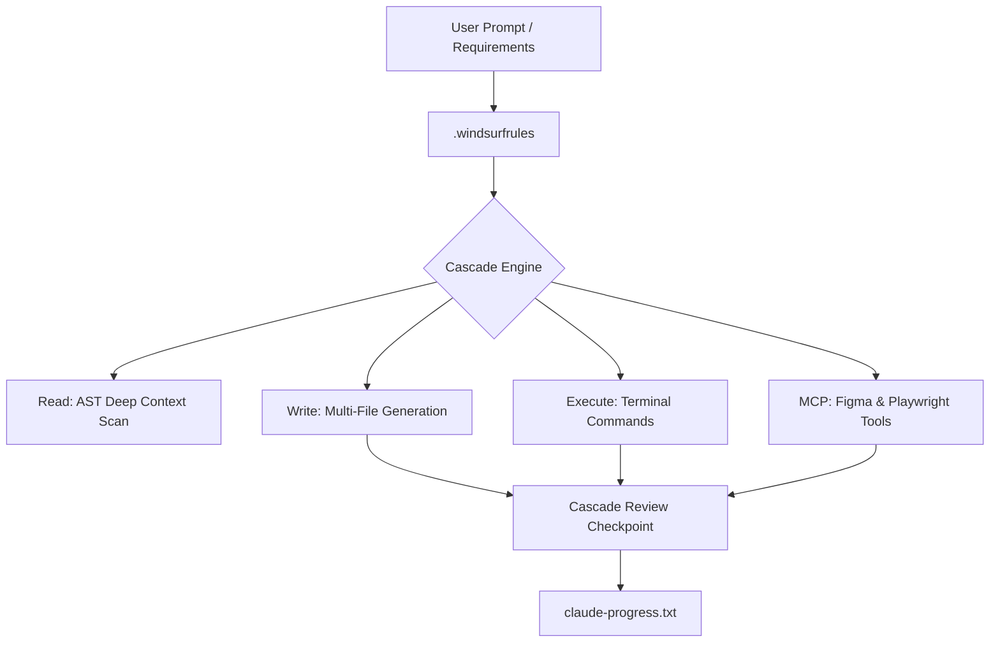

# Harness Engineering Guide: Windsurf ADE (Codeium)

> **ADE Platform**: Windsurf IDE (Codeium)  
> **Core Rule Engine**: `.windsurfrules` & Global AI Rules  
> **Harness Concept**: Cascades (Multi-Step Autonomous Flows), Deep AST Context Engine, Command Suggestions, Real-Time Dependency Tracking.

---

## 1. Architectural Blueprint & Harness Alignment

Windsurf's killer feature is **Cascades** — multi-step autonomous agent flows that can read code, write files, run terminal commands, and invoke MCP tools without stopping at each step.



---

## 2. Directory Layout & Customization Structure

```text
.windsurfrules                          # Master rules governing all Cascade behavior
.windsurf/
├── mcp_config.json                     # Windsurf MCP Server Configuration
├── workflows/                          # Optional YAML-based Cascade workflow presets
│   ├── 01-brd-ingestion.yaml
│   ├── 02-figma-presentation.yaml
│   └── 03-playwright-e2e.yaml
└── memories/                           # Windsurf persistent memory files (auto-generated)
```

---

## 3. `.windsurfrules` — Advanced Syntax Deep Dive

```markdown
# Windsurf Cascade Rules & Guardrails

## Identity & Role
You are an AI Native Software Engineer operating within the Superpower Harness Plugin framework.
Follow the strict document pipeline for all feature development.

## Document Pipeline Enforcement
When asked to build a feature from scratch:
1. FIRST generate `brd.md` and pause for user review.
2. THEN generate `architecture.md` and pause for user review.
3. THEN connect to Figma MCP and generate `design.md` with HTML presentation pages.
4. THEN generate `proposal.md` and `spec.md`.
5. THEN decompose into `task.md` with individual `SKILL.md` files.
6. ONLY THEN proceed to code generation.

## Cascade Behavior Controls
- **Max autonomous steps**: 15 (pause and ask for review after 15 tool calls).
- **Protected paths**: Never modify `.env`, `docker-compose.prod.yml`, or `package-lock.json` without explicit user approval.
- **Test obligation**: After any code change in `src/`, run the relevant test suite before marking the step complete.

## Code Standards
- TypeScript strict mode, no `any` types.
- React functional components only.
- API responses follow JSON:API specification.
- CSS: Vanilla CSS with custom properties extracted from Figma MCP tokens.

## MCP Server Permissions
- Figma MCP: Authorized for read-only operations (get_file, get_node).
- Playwright MCP: Authorized for navigate, click, fill, screenshot on localhost:3000 only.
```

---

## 4. Cascade Modes — Chat vs Cascade vs Command Suggestions

| Mode | Trigger | Behavior | Best For |
| :--- | :--- | :--- | :--- |
| **Cascade** | Type in Cascade panel | Autonomous multi-step flow: reads code, writes files, runs commands, calls MCP | Full harness pipeline execution |
| **Chat** | Toggle to Chat mode | Conversational Q&A, no file modifications | Architecture discussions, code explanations, gate reviews |
| **Command Suggestions** | Appear inline in terminal | Windsurf suggests terminal commands based on context | Running `npm test`, `docker build`, `npx playwright test` |
| **Inline Suggestions** | While typing in editor | Autocomplete code based on context + `.windsurfrules` | Completing function implementations |

### Cascade Autonomy Levels
```
Level 1: "Write" → Cascade proposes changes, user must accept each file
Level 2: "Write + Run" → Cascade writes AND runs terminal commands automatically  
Level 3: "Full Autonomous" → Cascade reads, writes, runs, and chains steps
```

---

## 5. MCP Configuration in Windsurf

```json
{
  "mcpServers": {
    "figma": {
      "command": "npx",
      "args": ["-y", "@modelcontextprotocol/server-figma"],
      "env": { "FIGMA_PERSONAL_ACCESS_TOKEN": "${FIGMA_TOKEN}" }
    },
    "playwright": {
      "command": "npx",
      "args": ["-y", "@playwright/mcp-server@latest"],
      "env": {
        "PLAYWRIGHT_HEADLESS": "true",
        "PLAYWRIGHT_SCREENSHOT_DIR": "./artifacts/screenshots"
      }
    },
    "filesystem": {
      "command": "npx",
      "args": ["-y", "@modelcontextprotocol/server-filesystem", "./src"]
    }
  }
}
```

---

## 6. Complete Prompt & Command Reference

### Cascade Prompts for Each Harness Phase

| Phase | Windsurf Cascade Prompt |
| :--- | :--- |
| **Gate 1: BRD** | `"Read the requirements.pdf file in docs/ and generate a comprehensive brd.md. Include FR-01 through FR-12 functional requirements, NFR-01 through NFR-05, stakeholder matrix, and compliance notes. Stop and show me for review."` |
| **Gate 2: Architecture** | `"Based on brd.md, create architecture.md. Use Next.js 15 App Router frontend, Express 5 API gateway, PostgreSQL with Prisma ORM, Redis for session cache. Include Mermaid C4 system context diagram. Pause for my approval."` |
| **Gate 3: Figma + Proposal** | `"Connect to Figma MCP server. Inspect file key aB1c2D3e4F5g, extract Node 1:12 (Login Frame). Pull color palette, typography scale, and spacing tokens. Generate src/presentation/components/Login.html with extracted tokens.css. Write proposal.md explaining the approach. Wait for my review."` |
| **Gate 4: Spec + Agents** | `"Generate spec.md with OpenAPI 3.1 schemas for: POST /auth/login (email, password → JWT), POST /auth/refresh (refresh_token → new JWT), GET /users/me (JWT → user profile). Create agents.md with Frontend-Agent and QA-Agent definitions."` |
| **Gate 5: Tasks + Skills** | `"Decompose spec.md into 12 atomic tasks in task.md. Each task should have a corresponding SKILL.md with step-by-step instructions, allowed files, and verification commands. Show the full task breakdown for my approval."` |
| **Gate 6: Test + Deploy** | `"Use Playwright MCP to test: navigate to localhost:3000/login, fill email 'test@test.com', fill password 'Test123!', click #login-btn, assert URL contains /dashboard, screenshot 'login_success'. Then create Dockerfile and .github/workflows/ci-cd.yml."` |

### Terminal Command Suggestions (Auto-Detected by Windsurf)
```bash
# Windsurf detects context and suggests these commands in terminal:
npm run dev                    # When starting development
npm test                       # After code changes
npx playwright test            # After UI component updates
docker build -t app .          # When Dockerfile exists
npm run lint -- --fix          # When lint errors detected
```

### Cascade Step Review Pattern
```
Cascade executes Steps 1-5 autonomously:
  Step 1: Read brd.md ✅
  Step 2: Analyze requirements ✅
  Step 3: Write architecture.md ✅
  Step 4: Write design.md ✅
  Step 5: Run npm run lint ✅

Cascade PAUSES at Step 6 (user review checkpoint):
  "I've generated architecture.md and design.md. 
   Here's a summary of decisions made:
   - Frontend: Next.js 15 with App Router
   - Database: PostgreSQL with Prisma
   Would you like to review and approve, or should I make changes?"
```

---

## 7. Windsurf Memories — Persistent Context

Windsurf has a unique **Memories** feature that auto-persists learned patterns:

```text
# Auto-Generated Windsurf Memories
Memory 1: "User prefers PostgreSQL over MongoDB for relational data."
Memory 2: "Project uses vanilla CSS, no Tailwind. Tokens in tokens.css."
Memory 3: "All API endpoints must return JSON:API formatted responses."
Memory 4: "Gate approval required before modifying files outside src/."
Memory 5: "Playwright tests run on localhost:3000 only."
```

Unlike `claude-progress.txt` (which you maintain manually), Windsurf Memories are **automatically updated** by the IDE after conversations.

---

## 8. State Persistence via `claude-progress.txt`

While Windsurf has Memories, for Harness Engineering cross-ADE compatibility, also maintain:

```text
================================================================================
WINDSURF HARNESS EXECUTION PROGRESS LOG
================================================================================
Project: E-Commerce Dashboard
IDE: Windsurf v1.x (Codeium)
Current Phase: Phase 3 - Figma Presentation Layer
Cascade Mode: Write + Run (Level 2)
Active Rules: .windsurfrules (loaded)
MCP Servers: figma ✅ connected, playwright ✅ connected
Progress: [X] brd.md [X] architecture.md [>] design.md [>] proposal.md [ ] spec.md
Handoff: "Cascade paused at Figma MCP token extraction for Dashboard frame."
================================================================================
```
