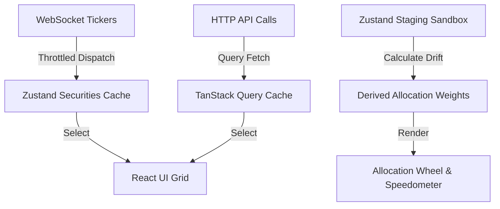

# System Architecture: Wealth Management Advisor Console

This document outlines the architectural patterns, state boundaries, data flow models, and non-functional engineering standards of the Wealth Management Advisor Console.

---

## 1. Architectural Layers & Separation of Concerns

The codebase enforces strict horizontal boundaries to prevent logical bleeding and ensure high unit-testability:

```
┌─────────────────────────────────────────────────────────┐
│                    Presentation Layer                   │
│          (React Components / Custom CSS Modules)        │
└────────────────────────────┬────────────────────────────┘
                             │ Uses Selectors / Actions
┌────────────────────────────▼────────────────────────────┐
│                    Application State                    │
│     (Zustand UI Stores / TanStack Query Server Cache)   │
└────────────────────────────┬────────────────────────────┘
                             │ Invokes Client Calls
┌────────────────────────────▼────────────────────────────┐
│                    Data-Access Layer                    │
│      (Typed REST Clients / WebSocket Event Channels)    │
└─────────────────────────────────────────────────────────┘
```

### Presentation Layer
*   Uses **Atomic Component design** (atoms, molecules, organisms, templates) located in `@wma/shared-ui` for base components and local feature-level components in `apps/advisor-console/src/features/`.
*   Contains **no side-effects** or raw API requests. Data is accessed via Zustand state selectors or TanStack Query custom hooks.
*   Uses CSS Modules for component styling.

### Application/State Layer
*   **Transient state** (active household, drawer open states, staging sandbox values) is stored in client-side **Zustand** stores.
*   **Server state** (historical performance data, client list lookup, portfolio holding matrices) is managed by **TanStack Query**, providing automatic caching, stale-while-revalidate fetching, and refetch invalidations.
*   **Derived state** (portfolio asset class weights, total unrealized gains/losses, target model drift percentage) is computed purely in memory using memoized selectors, preventing duplicate source of truth.

### Data-Access Layer
*   All communications with backend APIs are written in `@wma/shared-utils/client` as structured class services returning typed TypeScript payloads.
*   WebSocket connection listeners run in dedicated event channels, parsing and validating updates before dispatching them to the application state manager.

---

## 2. State Management Architecture



### Real-Time Update Synchronization
To handle high-frequency WebSocket quotes without locking up the client UI thread:
1.  **Tick Coalescing**: WebSockets push events to an in-memory ring buffer.
2.  **RequestAnimationFrame (rAF) Loop**: A custom hook polls the ring buffer at most 60 times a second, merging updates into a single batch and updating the Zustand store.
3.  **Cell-Level Updates**: Components subscribe to specific security IDs. Only the specific cell rendering the changed price is re-rendered (using React memoization keys), keeping the scroll performance at a smooth 60fps.

---

## 3. High Performance Engineering

-   **Virtual List Scrolling**: Large grids (like the book of business list and the holdings grid with up to 10k rows) utilize `@tanstack/react-virtual` to ensure only the elements in the user's viewport are rendered in the DOM.
-   **Lazy Loading & Code Splitting**: Main modules like `/onboarding`, `/rebalancing`, and PDF Preview generators are imported via dynamic imports:
    ```typescript
    const RebalancingModule = React.lazy(() => import('./features/rebalancing'));
    ```
-   **Prefetching on Hover**: To decrease perceived latency, hovering over a client in the Book of Business triggers a prefetch command to TanStack Query for the household holdings data.

---

## 4. Accessibility Strategy (WCAG 2.1 AA)

-   **Keyboard Operation**: Standardized keyboard focus indicators. The data grid supports Arrow navigation, Tab focusing, and Escape keys to exit editing fields.
-   **Screen Reader Integration**: Use of standard HTML5 semantic elements (`<header>`, `<nav>`, `<main>`, `<section>`). Status notifications (e.g. compliance drift warnings, WebSocket disconnection banners) utilize `aria-live="polite"` to announce updates to assistive tech without interrupting workflows.
-   **Color Invariant UI**: Gains are styled green and losses red, but they are *always* accompanied by up/down arrow indicators or text labels to ensure accessibility for colorblind individuals.

---

## 5. Security & Privacy Safeguards

-   **SSN & Tax ID Masking**: Tax IDs are masked by default (`***-**-1234`). Revealing the full ID requires a cursor hover or action click, which writes a trackable event log to the audit history timeline.
-   **Token Security**: JSON Web Tokens (JWT) are stored in secure memory closures rather than LocalStorage. Refresh tokens are secured via `HttpOnly` cookie wrappers, guarding the application from Cross-Site Scripting (XSS) extraction.
-   **Strict Content Security Policy (CSP)**: Rejects dangerous source injection, unapproved script execution, and style eval blocks.
