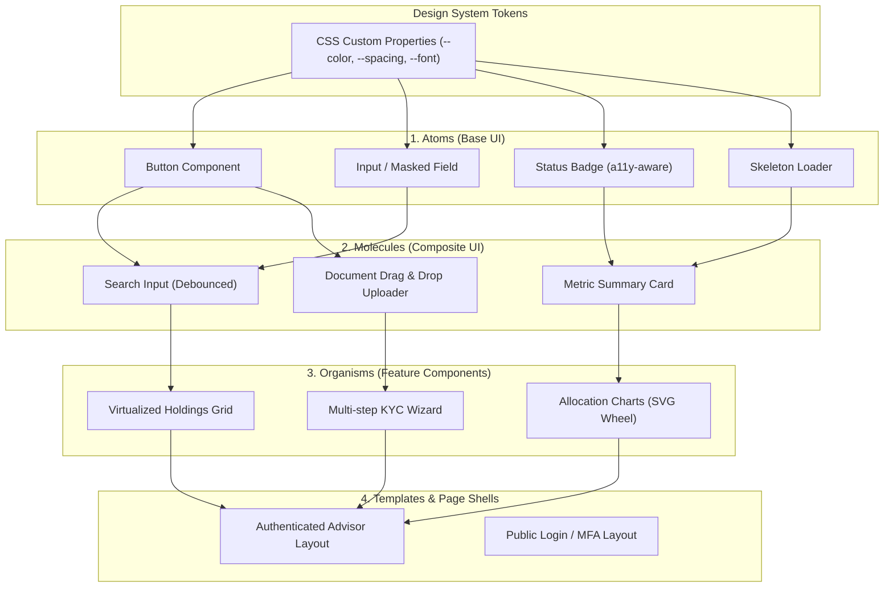
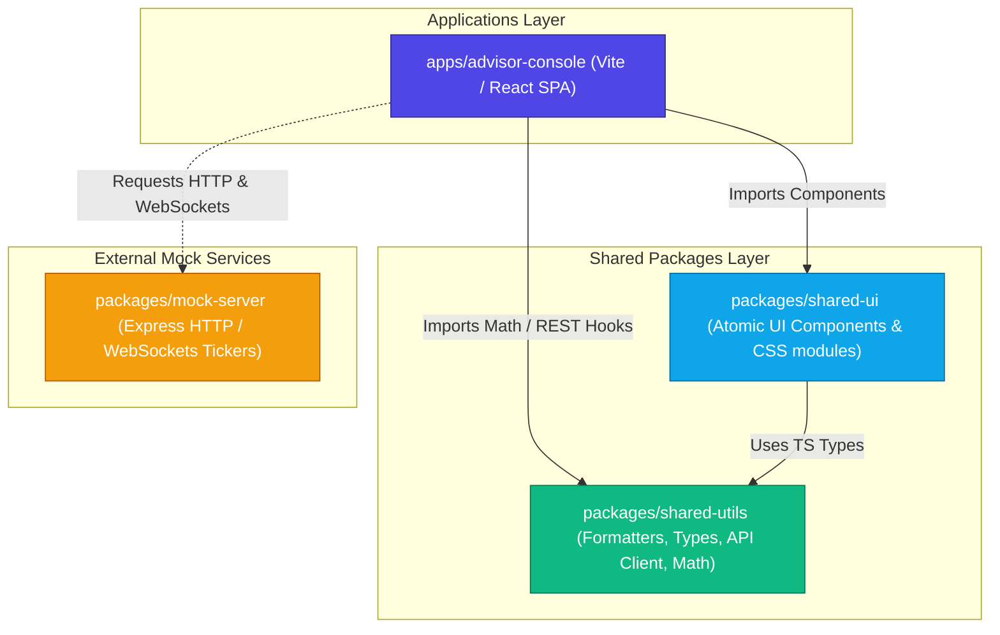
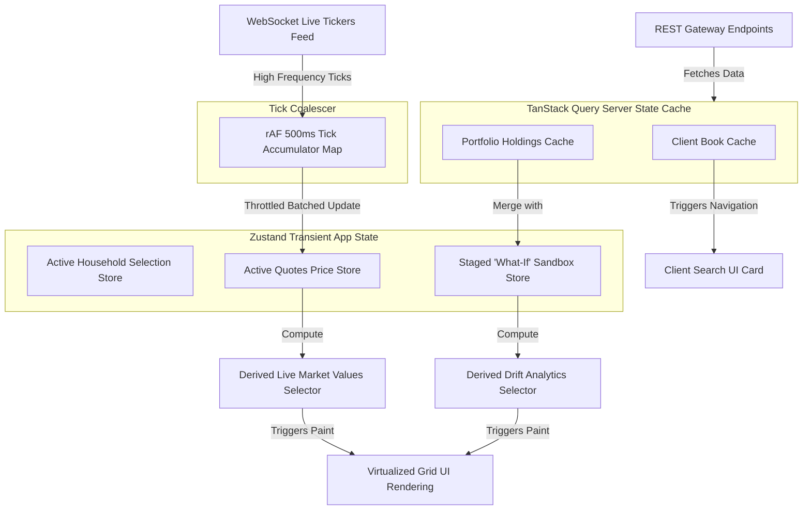

# Architectural Diagrams

This document contains visual diagrams mapping out the component hierarchy, feature modularity, and real-time state data flows of the Wealth Management Advisor Console.

---

## 1. Component Diagram (Atomic Design System)
*Reference Deliverable: D-3 Component Diagram*

The component design follows the Atomic Design principles, defining clear relationships between styling tokens, atomic controls, composite molecules, and fully integrated page structures:

---

## 2. Monorepo Module Dependencies Graph
*Reference Deliverable: D-4 Module Diagram*

This diagram maps workspace package boundaries. Notice that dependencies point inward toward shared packages, and features remain completely decoupled to avoid circular conflicts:

---

## 3. State Management & Real-Time Sync Flows
*Reference Deliverable: D-5 State Management Diagram*

This diagram details client-side state mapping, illustrating how WebSockets stream ticks through coalescing buffers, while Rest APIs communicate via query caches:

