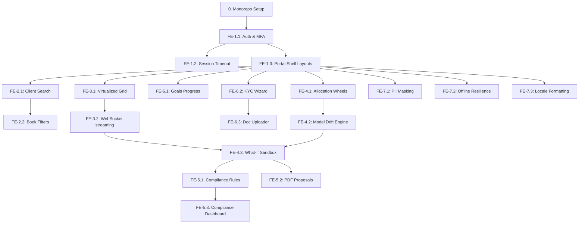

# Master Execution Plan

This master plan establishes the chronological execution sequence for the Wealth Management Advisor Console, mapping out feature implementation order based on dependency graphs declared in `features.json`.

---

## 🗺️ Chronological Roadmap & Dependency Flow

---

## 📅 Chronological Backlog Plan

| Phase | Target Features | Primary Deliverable | Dependency |
| :--- | :--- | :--- | :--- |
| **Phase 1: Foundation & Shell** | Setup, `FE-1.1`, `FE-1.2`, `FE-1.3` | App shell with secure login and routing gates | None |
| **Phase 2: Client Directories** | `FE-2.1`, `FE-2.2`, `FE-6.1`, `FE-6.2`, `FE-6.3` | Book of Business dashboards, KYC onboarding steppers, and goal widgets | `FE-1.3` |
| **Phase 3: Real-time Grids** | `FE-3.1`, `FE-3.2` | High-frequency virtualized price streaming table | `FE-1.3` |
| **Phase 4: Sandbox & Gating** | `FE-4.1`, `FE-4.2`, `FE-4.3`, `FE-5.1`, `FE-5.2`, `FE-5.3` | Rebalancing sandbox workspace, compliance filters, and print PDF generators | `FE-3.2`, `FE-4.2` |
| **Phase 5: Cross-Cutting NFRs** | `FE-7.1`, `FE-7.2`, `FE-7.3` | Masking routines, offline state resolution, and locales mapping | `FE-1.3` |

---

## 📂 Implementation Guides Directory Map
For detailed step-by-step guidance instructions matching each phase, refer to the individual plan files:
1.  **[epic1_auth_shell.md](file:///c:/Users/rajap/Downloads/Wealth%20Management%20Advisor/docs/plans/epic1_auth_shell.md)**: Workspace initialization, secure route configuration, and session timeouts.
2.  **[epic2_book_search.md](file:///c:/Users/rajap/Downloads/Wealth%20Management%20Advisor/docs/plans/epic2_book_search.md)**: Search indexing, keyboard event captures, and client dashboards.
3.  **[epic3_grid_ticker.md](file:///c:/Users/rajap/Downloads/Wealth%20Management%20Advisor/docs/plans/epic3_grid_ticker.md)**: Windowed virtualization, WebSocket connections, and cell paints.
4.  **[epic4_analytics_rebalance.md](file:///c:/Users/rajap/Downloads/Wealth%20Management%20Advisor/docs/plans/epic4_analytics_rebalance.md)**: Charting coordinates, model conversions, and what-if staged orders store slices.
5.  **[epic5_compliance_reports.md](file:///c:/Users/rajap/Downloads/Wealth%20Management%20Advisor/docs/plans/epic5_compliance_reports.md)**: Rule checking hooks, override justification flows, and print-ready stylesheets.
6.  **[epic6_goals_onboarding.md](file:///c:/Users/rajap/Downloads/Wealth%20Management%20Advisor/docs/plans/epic6_goals_onboarding.md)**: Wizard steppers, IndexedDB auto-saves, and upload progress widgets.
7.  **[epic7_cross_cutting_nfrs.md](file:///c:/Users/rajap/Downloads/Wealth%20Management%20Advisor/docs/plans/epic7_cross_cutting_nfrs.md)**: Auto-masking timers, network state gating, and localization mapping.
