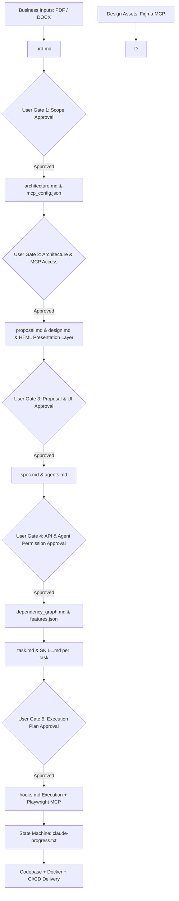
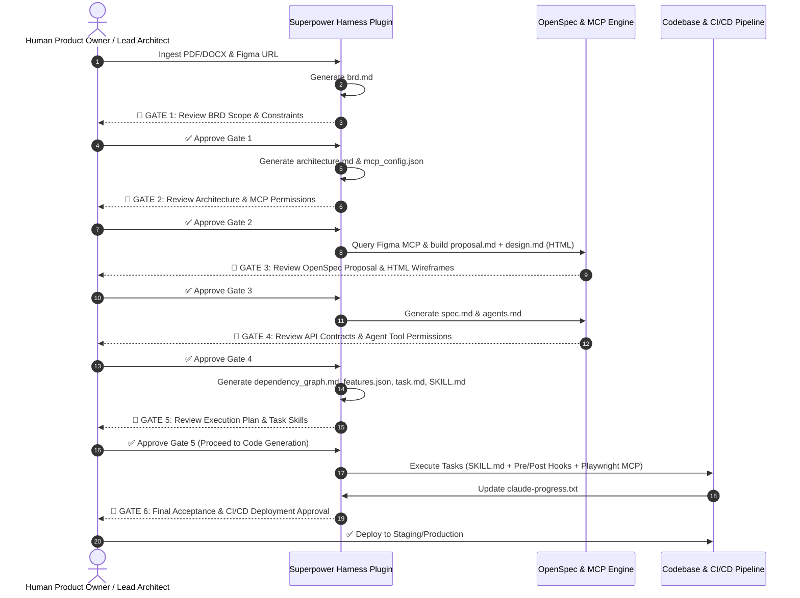
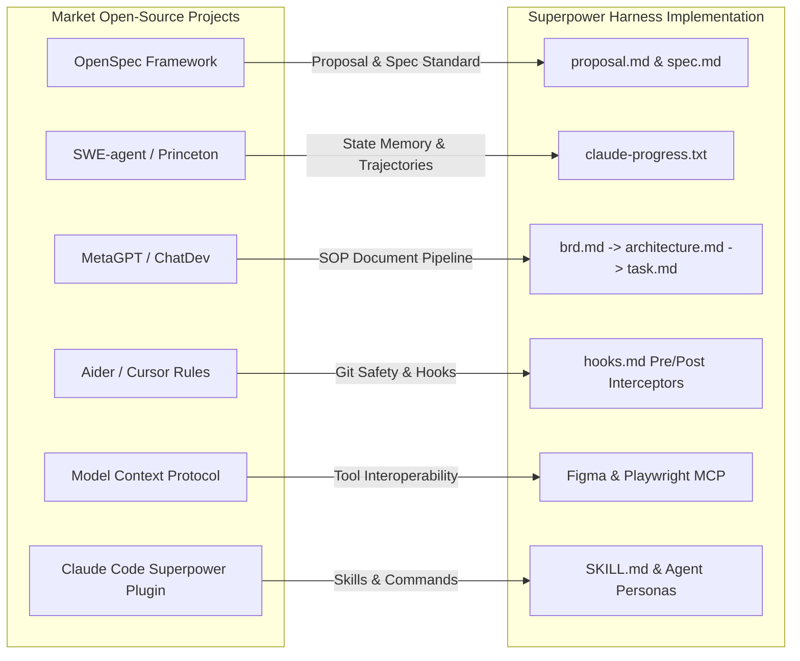

# Superpower Harness Plugin: Master Guidance & Engineering Framework

> **AI Native Software Engineering Master Standard**  
> *A systematic framework for converting raw business inputs (PDF/DOCX) and design assets (Figma MCP) into deterministic, agent-executable architectural blueprints, OpenSpec change proposals, plugin harnesses, MCP integrations, stateful memory tracking, Playwright E2E testing, human-in-the-loop approval gates, containerization, and CI/CD delivery.*

---

## 1. Executive Summary & Core Philosophy

The **Superpower Harness Plugin Framework** bridges non-deterministic business requirements (PDF/DOCX) and design assets (Figma) with deterministic software execution, testing (Playwright MCP), and human-in-the-loop governance. Built on the principles of **AI Native Software Engineering**, it leverages autonomous agents, OpenSpec standards (`proposal.md`, `spec.md`), declarative skill files (`SKILL.md`), agent definitions (`agents.md`), context-aware lifecycle hooks (`hooks.md`), **Model Context Protocol (MCP) Servers**, and state/memory tracking (`claude-progress.txt`).



---

## 2. Layer-by-Layer User Approval & Confirmation Gates Matrix

To guarantee human control, avoid unintended code drift, and enforce zero-hallucination guardrails, the framework mandates explicit **User Confirmation Gates** between every major phase.



### Detailed Gate Protocol Table

| Gate Phase | Trigger Artifacts | Key User Inspection Points | Required User Action / Command |
| :--- | :--- | :--- | :--- |
| **Gate 1: Requirements Approval** | `brd.md` | Functional scope, out-of-scope boundaries, non-functional constraints. | Approve scope or request additions in `brd.md`. |
| **Gate 2: Architecture & Security** | `architecture.md`, `mcp_config.json` | System topology, database selection, third-party MCP tool permissions. | Authorize MCP tool scopes and infrastructure topology. |
| **Gate 3: OpenSpec Proposal & UI** | `proposal.md`, `design.md`, HTML pages | Business rationale, trade-offs, UI mockups generated via Figma MCP. | Review visual presentation layer & proposal justification. |
| **Gate 4: Spec & Agent Definition** | `spec.md`, `agents.md` | OpenAPI endpoints, data schemas, subagent persona limits, tool access. | Approve API data contracts & subagent roles. |
| **Gate 5: Execution Plan & Skills** | `dependency_graph.md`, `features.json`, `task.md`, `SKILL.md` | Order of task execution, skill prompt instructions, test assertions. | Approve execution DAG and individual task skill guardrails. |
| **Gate 6: Delivery & Deployment** | Playwright MCP Reports, Docker build logs, CI/CD pipeline | Visual regression screenshots, unit/E2E test pass rate (100%), Docker image size. | Confirm production deployment trigger. |

---

## 3. OpenSpec Standard Integration (`proposal.md`, `spec.md`, `SKILL.md`, `agents.md`)

The framework implements **OpenSpec** (an open specification standard for AI-driven software evolution). Changes are managed through declarative spec directories.

```text
.openspec/
├── proposal.md            # High-level change rationale, trade-offs & impact analysis
├── design.md              # Technical design & Figma MCP HTML presentation layer
├── spec.md                # Executable API specifications, schemas & edge cases
├── agents.md              # Agent persona definitions, MCP tool bindings & rules
├── skills/                # Encapsulated skill instruction sets
│   ├── auth-skill/
│   │   └── SKILL.md
│   └── testing-skill/
│       └── SKILL.md
└── hooks.md               # Lifecycle safety hooks & linters
```

### 1. `proposal.md` Blueprint
* **Purpose**: Explains *why* a feature is being built, alternative approaches considered, breaking changes, and risk mitigations before any code is modified.

```markdown
# OpenSpec Proposal: OAuth2 & RBAC Auth Engine

## Executive Summary
This proposal introduces a unified OAuth2 authentication service integrated with Figma design tokens and Playwright testing verification.

## Rationale & Alternatives
- **Selected Approach**: JWT with short-lived access tokens and refresh token rotation.
- **Alternatives Considered**: Session-based auth (rejected due to microservice scaling constraints).

## Impact Analysis
- **Affected Specs**: `spec/auth_spec.md`, `spec/user_spec.md`
- **MCP Dependencies**: Figma MCP (`Node 1:12` Login Frame), Playwright MCP (`tests/e2e/auth.spec.ts`).
- **User Approval Required**: Yes (Gate 3).
```

### 2. `spec.md` Blueprint
* **Purpose**: Defines technical API requirements, endpoints, payload schemas, edge cases, and error states.

### 3. `agents.md` Blueprint with MCP & Skill Bindings
* **Purpose**: Maps autonomous subagents to specific `spec.md` files, bound to authorized MCP tools and `SKILL.md` workflows.

```markdown
# OpenSpec Agent Declarations

## Agent: Frontend-Presentation-Agent
- **Assigned Spec**: `spec/presentation_layer_spec.md`
- **Bound Skills**: `skills/figma-html-conversion/SKILL.md`
- **Authorized MCP Tools**: 
  - `figma/get_file`
  - `figma/get_node`
  - `filesystem/write_file`
- **System Guard**: May only modify files under `src/presentation/`.

## Agent: Playwright-QA-Agent
- **Assigned Spec**: `spec/e2e_testing_spec.md`
- **Bound Skills**: `skills/playwright-testing/SKILL.md`
- **Authorized MCP Tools**:
  - `playwright/navigate`
  - `playwright/click`
  - `playwright/fill`
  - `playwright/screenshot`
- **System Guard**: Cannot modify production application logic; test files only.
```

---

## 4. Realistic Alignment with Leading Open-Source Projects & Market Ecosystems

The Superpower Harness framework synthesizes patterns from top open-source AI engineering projects:



### Direct Market Comparisons

1. **OpenSpec Specification Standard** (`github.com/openspec`):
   - *Harness Alignment*: Adopts the exact directory layout (`proposal.md`, `spec.md`, `agents.md`, `skills/`). Features are proposed and approved *before* implementation.
2. **SWE-agent** (Princeton University - `github.com/princeton-nlp/SWE-agent`):
   - *Harness Alignment*: Uses `claude-progress.txt` to track execution trajectories, preventing context degradation during multi-turn coding sessions.
3. **MetaGPT & ChatDev** (`github.com/geekan/MetaGPT` / `github.com/OpenBMB/ChatDev`):
   - *Harness Alignment*: Translates standard operating procedures (SOPs) into structured documents (`brd.md` $\rightarrow$ `architecture.md` $\rightarrow$ `design.md` $\rightarrow$ `task.md`), ensuring role-based multi-agent execution.
4. **Claude Code Superpower Plugins** (`github.com/anthropic-claude/superpower` / community harnesses):
   - *Harness Alignment*: Uses `SKILL.md` files with YAML frontmatter, modular slash commands, and declarative `hooks.md` interceptors (`PreToolUse` / `PostToolUse`).
5. **Aider & Cursor Ecosystem** (`github.com/paul-gauthier/aider` / `.cursorrules`):
   - *Harness Alignment*: Incorporates git-backed execution checkpoints, linting hooks, and workspace-scoped agent rule files.

---

## 5. Comparative Matrix: Architectural & Structural Alignment of Modern ADEs

| Feature / Dimension | AntiGravity (Google DeepMind) | Cursor | VS Code + GitHub Copilot | Windsurf (Codeium) | Open Spec / Kiro | Claude Code (CLI Harness) |
| :--- | :--- | :--- | :--- | :--- | :--- | :--- |
| **Primary Rule Vector** | `AGENTS.md` (Global & Workspace) | `.cursorrules` / `.cursor/rules/*.mdc` | `.github/copilot-instructions.md` | `.windsurfrules` | `openspec/` schema directory | `CLAUDE.md` / `config.json` |
| **User Approval Gates** | Built-in interactive modals (`ask_question` / approval steps) | Manual inline Composer accept/reject | Copilot Chat prompt approval | Cascade user review step | OpenSpec Gate validation commands | CLI interactive prompt prompts |
| **MCP Integration** | First-class native MCP tools | Native MCP Config (`.cursor/mcp.json`) | VS Code MCP Extensions | Native MCP Tool integration | OpenSpec plugin runner | Native MCP Config (`.claude/mcp.json`) |
| **Figma MCP Ingestion** | Node inspect & token export to HTML | Figma API / `@` context rules | Copilot Custom Agent extensions | Figma Cascade flow | Spec-driven Figma AST parser | Figma MCP tool calls (`get_node`) |
| **Playwright MCP Testing** | Playwright MCP subagent execution | Browser / Terminal runner | Copilot Test Agent | Autonomous Cascade testing | Automated test runner hooks | Playwright MCP tool calls (`navigate`, `screenshot`) |
| **Skill Encapsulation** | `skills/<name>/SKILL.md` | Custom Instructions / Prompts | `.github/prompts/` | Custom Workflows | `skills/<name>/SKILL.md` | Custom Slash Commands & Tool Scripts |
| **Lifecycle Hooks (`hooks.md`)** | Pre/Post Tool call interceptors | Linter hooks & formatters | Extensions / Task triggers | Cascade rule checks | Test/lint validation hooks | PreToolUse & PostToolUse bash/JSON hooks |
| **Memory Persistence** | Artifact transcripts + `claude-progress.txt` | Indexer DB + `conversations` state | Chat session history | Context buffer & snapshot log | Delta spec files | `claude-progress.txt` / history logs |

---

## 6. Model Context Protocol Manifest (`mcp_config.json`)

```json
{
  "mcpServers": {
    "figma": {
      "command": "npx",
      "args": ["-y", "@modelcontextprotocol/server-figma"],
      "env": {
        "FIGMA_PERSONAL_ACCESS_TOKEN": "${FIGMA_TOKEN}"
      }
    },
    "playwright": {
      "command": "npx",
      "args": ["-y", "@playwright/mcp-server@latest"],
      "env": {
        "PLAYWRIGHT_HEADLESS": "true",
        "PLAYWRIGHT_SCREENSHOT_DIR": "./artifacts/screenshots"
      }
    }
  }
}
```

---

## 7. State Machine & Memory Management via `claude-progress.txt`

```text
================================================================================
SUPERPOWER HARNESS EXECUTION PROGRESS LOG
================================================================================
Project: Superpower Framework App
Current Phase: Phase 3 - OpenSpec Proposal & Figma Presentation Layer
Last Updated: 2026-07-26T19:05:02Z
Session ID: 14bfba91-95ba-44b5-a9da-2a05f8362ba1
================================================================================

[COMPLETED USER APPROVAL GATES]
- [X] GATE 1: BRD Scope & Constraints Approved by User
- [X] GATE 2: Architecture & MCP Access Authorized by User
- [X] GATE 3: OpenSpec Proposal (proposal.md) & Figma HTML Presentation Layer Approved

[CURRENT WORK IN PROGRESS]
- [>] TASK-006: Generate spec.md & agents.md for User Gate 4 Review
      - Sub-step 1: Query Figma MCP for Navbar components [DONE]
      - Sub-step 2: Generate presentation/Navbar.html [DONE]
      - Sub-step 3: Formulate OpenAPI schemas in spec.md [IN-PROGRESS]
      - Sub-step 4: Request User Gate 4 Confirmation [PENDING]

[UNRESOLVED BLOCKS / ISSUES]
- Block 01: Waiting for User Gate 4 confirmation on spec/auth_spec.md.

[HANDOFF CONTEXT TOKEN FOR NEXT ITERATION]
"Context limit approaching. Resume at Gate 4 approval request for spec.md."
================================================================================
```

---

## 8. End-to-End Delivery: Scratch to Containerization & CI/CD

### Dockerfile (Multi-stage with Playwright Test Stage)

```dockerfile
FROM mcr.microsoft.com/playwright:v1.45.0-jammy AS build-and-test
WORKDIR /app
COPY package*.json ./
RUN npm ci
COPY . .
RUN npm run build
RUN npm run test:e2e

FROM node:20-alpine AS runner
WORKDIR /app
ENV NODE_ENV=production
RUN addgroup --system --gid 1001 nodejs && adduser --system --uid 1001 appuser
COPY --from=build-and-test /app/dist ./dist
COPY --from=build-and-test /app/package*.json ./
RUN npm ci --only=production
USER appuser
EXPOSE 3000
CMD ["node", "dist/index.js"]
```

### GitHub Actions CI/CD Pipeline

```yaml
name: Superpower Harness CI/CD Pipeline

on:
  push:
    branches: [ main, develop ]
  pull_request:
    branches: [ main ]

jobs:
  validate-and-test:
    runs-on: ubuntu-latest
    steps:
      - name: Checkout Repository
        uses: actions/checkout@v4

      - name: Setup Node.js
        uses: actions/setup-node@v4
        with:
          node-version: '20'
          cache: 'npm'

      - name: Install Dependencies
        run: npm ci

      - name: Install Playwright Browsers
        run: npx playwright install --with-deps

      - name: Check Code Syntax & Linting
        run: npm run lint

      - name: Execute Playwright E2E Tests
        run: npm run test:e2e

      - name: Upload Playwright Test Screenshots & Artifacts
        if: always()
        uses: actions/upload-artifact@v4
        with:
          name: playwright-report
          path: playwright-report/
          retention-days: 14

      - name: Verify Feature Registry Completeness
        run: node scripts/verify-features.js

  docker-build-and-push:
    needs: validate-and-test
    runs-on: ubuntu-latest
    if: github.ref == 'refs/heads/main'
    steps:
      - name: Checkout Code
        uses: actions/checkout@v4

      - name: Set up Docker Buildx
        uses: docker/setup-buildx-action@v3

      - name: Log in to Container Registry
        uses: docker/login-action@v3
        with:
          registry: ghcr.io
          username: ${{ github.actor }}
          password: ${{ secrets.GITHUB_TOKEN }}

      - name: Build & Push Docker Image
        uses: docker/build-push-action@v5
        with:
          context: .
          push: true
          tags: ghcr.io/${{ github.repository }}/app:latest
```

---

## 9. Master Operational Checklist

```markdown
- [ ] 1. Ingest PDF/DOCX business requirements file & Figma file URL.
- [ ] 2. Generate brd.md -> 🛑 PAUSE FOR USER GATE 1 APPROVAL.
- [ ] 3. Generate architecture.md & mcp_config.json -> 🛑 PAUSE FOR USER GATE 2 APPROVAL.
- [ ] 4. Connect to Figma MCP, extract design tokens & compile HTML presentation pages in design.md + proposal.md -> 🛑 PAUSE FOR USER GATE 3 APPROVAL.
- [ ] 5. Generate spec.md and assign subagents in agents.md -> 🛑 PAUSE FOR USER GATE 4 APPROVAL.
- [ ] 6. Render dependency_graph.md, build features.json, task.md, and SKILL.md files -> 🛑 PAUSE FOR USER GATE 5 APPROVAL.
- [ ] 7. Execute code generation loop with hooks.md (PreToolUse/PostToolUse).
- [ ] 8. Run Playwright MCP automated E2E tests and screenshot validation.
- [ ] 9. Maintain claude-progress.txt state machine across agent execution steps.
- [ ] 10. Containerize application via multi-stage Dockerfile and push to registry via CI/CD upon Gate 6 User Approval.
```
